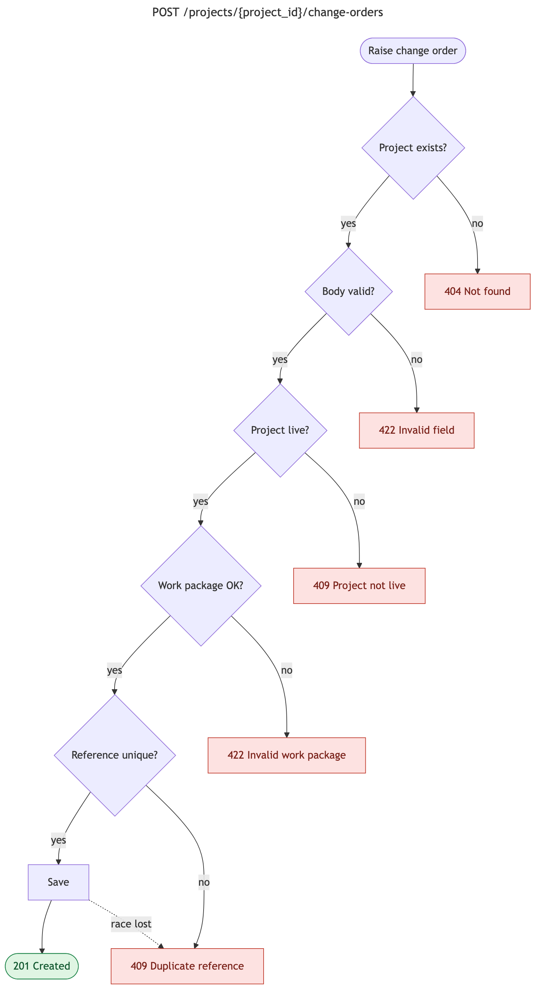

# SOLUTION — Raise a change order

Planners can now raise a change order against a project and one of that project's work
packages, via `POST /projects/{project_id}/change-orders` (`createChangeOrder`).

## Running it

I added a make file that ties it all together, I asked claude to write the make, the prompts were along
the lines of `add Command X to the makefile` or `chain the commands in make file far thus far to spin up in 1 command`

```bash
cd base-app
make dev    # install deps, regenerate the API client, run API (:8000) + UI (:4200)
make test   # API test suite
make fix    # ruff autofix + format
make api    # regenerate contracts/openapi.json + libs/api-client from the API
make db     # psql shell into the Docker Postgres
```
`make lint`-equivalent: `yarn api:lint` 

## Design

| Layer | File | Responsibility |
| --- | --- | --- |
| Request schema | `app/schemas.py` → `ChangeOrderCreate` | Request Shape and value rules; anything checkable without the dat§abase |
| Service | `app/services/change_orders.py` → `raise_change_order` | Service for business logic, separates its from router allowing it to stay thin |
| Router | `app/routers/change_orders.py` | Handles HTTP and response delagates logic to afore mentioend service |

The existing routers query the database inline, and I kept that for reads. This is the first
**write** with business rules, so I extracted a small service: the rules are unit-testable
without HTTP and reusable by future edit/import endpoints. `app/domain/` is documented as pure
(no I/O), so the service lives in a new `app/services/` package instead.

- Annotated test requests (every success and error case, with the response each returns): [change_order_post_requests.md](base-app/docs/change_order_post_requests.md)


## Validation



Source: [create-change-order-flow.mmd](base-app/docs/create-change-order-flow.mmd)

| Rule | Status | Error `loc` |
| --- | --- | --- |
| Rejects a project that does not exist | 404 | `"Project not found"` (I reused existing dependency) |
| Rejects a `reference` / `title` that is missing, blank or whitespace-only, or longer than 50 / 255 characters | 422 | `body.reference` / `body.title` |
| Rejects a `costDelta` that is zero or negative, has more than 2 decimal places, or has more than 12 digits before the decimal point | 422 | `body.costDelta` |
| Rejects a `scheduleDeltaDays` that is zero or negative, over 3650, or not a JSON integer (`true`, `"5"`, `2.0`) | 422 | `body.scheduleDeltaDays` |
| Rejects any `status` other than `draft` / `submitted` (defaults to `draft` when omitted) | 422 | `body.status` |
| Rejects a `raisedDate` that is malformed or more than one day in the future (defaults to today when omitted) | 422 | `body.raisedDate` |
| Rejects a `workPackageCode` that is missing, blank, unknown, or belongs to another project | 422 | `body.workPackageCode` |
| Rejects unknown fields (e.g. a client-chosen `id`) | 422 | `body.<field>` |
| Rejects a `reference` already used on this project, ignoring case | 409 | `body.reference` |

Errors raised by the service use the same `detail: [{loc, msg, type}]` shape as FastAPI's own
validation errors, so clients parse one format.

### Decisions

- **Raised date defaults to today.** Logging a change on the day is the common case, and
  forcing the field adds friction for no gain. Planners can still backdate.
  - The server runs in UTC, so "today" is the UTC date. Planners in different timezones
    can be on *tomorrow* so future dates are rejected beyond
    **today + 1 day**.
- **Status is optional, defaults to `draft`, and only `draft` / `submitted` are accepted.**
  Approving or rejcting is a separate control step by a different role, and approved
  `cost_delta` feeds forecast at completion. Allowing it on create would let a planner
  self-approve. The repo already had `CreateChangeOrderStatus` for exactly this.
- **Planners name a work package by `code`, not `id`.** The story speaks in codes (structural,
  MEP), and internal ids shouldn't come from clients. The lookup is scoped to the project, so
  "unknown code" and "another project's code" are one query and one error. The error doesn't
  reveal whether the code exists elsewhere.
- **A work package is required.** The story asks for a change order "against the project and the
  right work package", and the domain model says change orders roll up to the project through
  work packages. All seeded change orders have one. A change order without a work package would
  be missing from per-package cost views, which is the kind of bad record the brief warns about.
  Both live projects have work packages, so this never blocks a valid request.
- **409 for a duplicate reference, 422 for a bad work package.** A bad work package makes the
  request itself invalid. A duplicate is a valid request that conflicts with existing data.
- **References and work package codes are upper-cased** before checks and storage, so `co-001`
  is caught as a duplicate of `CO-001`, and `wp-01` resolves. This matches the seed data, and the
  database unique constraint keeps working as the backstop. Trade-off: the stored value can differ
  in case from what was sent.
- **Money is `Decimal` with `max_digits=14, decimal_places=2`**, matching the `Numeric(14, 2)`
  column. Without the bound, an oversized value passed validation and failed in Postgres as a 500.
  The OpenAPI schema is overridden to plain `number`; Pydantic's default for `Decimal` is
  `number | string`, which generated an awkward TypeScript type.
- **`scheduleDeltaDays` is capped at 3650 (10 years) and strict.** The cap is a sanity limit
  well under Postgres `int4`; before it, `3000000000` caused a 500. Strict mode stops `true`
  being read as `1`.
- **`extra="forbid"`**, so typos and attempts to set server-owned fields fail loudly instead of
  being dropped silently.

  ## Concurrency

- **Duplicate references:** Before inserting, the service checks whether the reference already exists on the project and returns a specific 409. If two requests race past that check at the same moment, the database's unique constraint rejects the second, which is mapped to the same 409.
- **No lost updates:** creating a change order only inserts a row, and never updates a stored total.

## Known limitations and next steps

- **Case-insensitive uniqueness is enforced by the API, not the database.** A write that
  bypasses the schema (seed, future import, manual SQL) could add `co-001` next to `CO-001`.
  Fix: a unique index on `(project_id, upper(reference))`. I didn't add it because it needs a
  migration (the repo has none), and that migration would fail on any existing case clashes.
  Fixing those means renaming references on financial records that are quoted elsewhere, which
  is a business decision.
- **Work package ownership is checked, not constrained.** The foreign key doesn't tie the work
  package to the same project. Fix: a composite FK `(project_id, work_package_id)`. Nothing can
  move work packages today, so it's theoretical for now. It also needs a migration, and any
  existing cross-project links would have to be re-pointed first, which changes what costs are
  booked against.
- **Retries:** if a successful create's response is lost and the client retries, it gets a 409
  and can't tell that its own request succeeded. Next: return the existing id in the 409, or
  support an `Idempotency-Key` header. With that header, the client sends a unique key (e.g. a
  UUID) per logical create and reuses it on retries. The server stores the key alongside the
  request body and the response it returned, in a new table with the key as primary key, scoped
  to the caller and expiring after e.g. 24h. A repeat with the same key and body replays the
  original 201. The same key with a different body is rejected with 422, and a repeat that
  arrives while the first is still running gets a 409. It needs a new table, a key store with
  cleanup, and a way to identify the caller (there's no auth yet), so it's more than this slice
  warrants.
- **"Today" in the project's timezone** would be more correct than UTC plus one day of slack, but
  projects have no timezone field. - This would require identifying this this being nullable for exisitng entries is ok
- **Tests run on SQLite**, which doesn't enforce integer widths or exercise real concurrency.
  A Postgres test run in CI would have caught the `int4` overflow directly.
- `NaN` / `Infinity` in `costDelta` (not valid JSON, but accepted by Python's parser) are rejected - Gives 500 -  Fix would be a RequestValidationError handler that converts non-finite input values to strings before rendering th§e 422.
  but FastAPI then fails to render the 422, which surfaces as a 500. Nothing is saved.
- No auth or roles, audit trail, or edit/approve workflow. Those are out of scope for this slice.

## Testing

63 tests pass (`make test`); ruff and mypy are clean. The repo has no coverage tooling, so I ran it
one-off without adding a dependency:

```bash
cd base-app/apps/api && uv run --with pytest-cov pytest --cov=app --cov-report=term-missing
```

| File | Coverage |
| --- | --- |
| `app/routers/change_orders.py` | 100% |
| `app/services/change_orders.py` | 100% |
| `app/schemas.py` | 100% |
| Whole API | 97% |


## AI / tooling disclosure

I drove the majority of decisions. 
I first matched a basic working POST using what's in place. i then mapped out the validation logics pretty much as it appears it the png. Initially I added this to router, once I had it working. I ran tests, and then asked claude to move it from the router to a service and ensured tests still passed, then I covered the service with tests.
Then i tested via CURL and via postman, and prompted claude to surface any edge case I had not, e.g.  the Postgres `int4` overflow, the UTC timezone rejection.


- **Environment and QOL:** writing the `makefile` helpers. I asked it give me 1 command spin up, then added easy clearing and seeding
  and commands to to simple day to days, e.g. tests, linting, etc...
- **Partial Implementation:** I proposed the schema rules, router and service code. I applied
  and edited most of it myself, step by step, and asked Claude to validate my edits along the way. It also helped refactor and move bits
- **Tests:** Claude wrote most of the test code at my request. I reviewed and ran it.
- **Review:** at my prompting, Claude probed the running API with edge cases and reviewed for
  races. That found the Postgres `int4` overflow, the UTC timezone rejection, all fixed above.
- **Images and Requests:** at my prompting claude created mermaid diagrams details changes thus, it needed asking twice
to get to the simplfied validation flows as its initial image was too busy. I also had it spit out a load of CURL requests that can be used to test the end point thoroughly.


